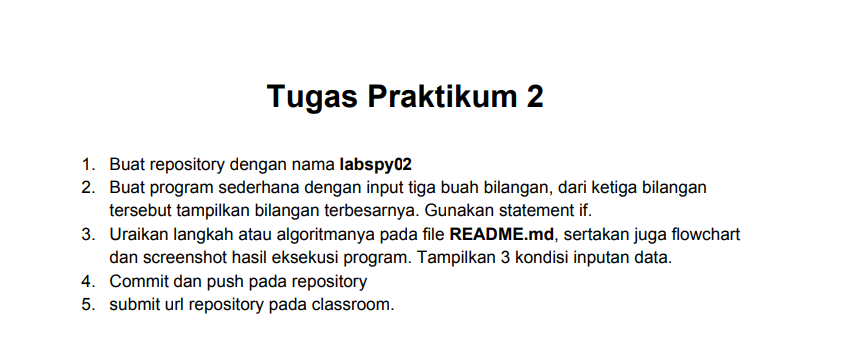
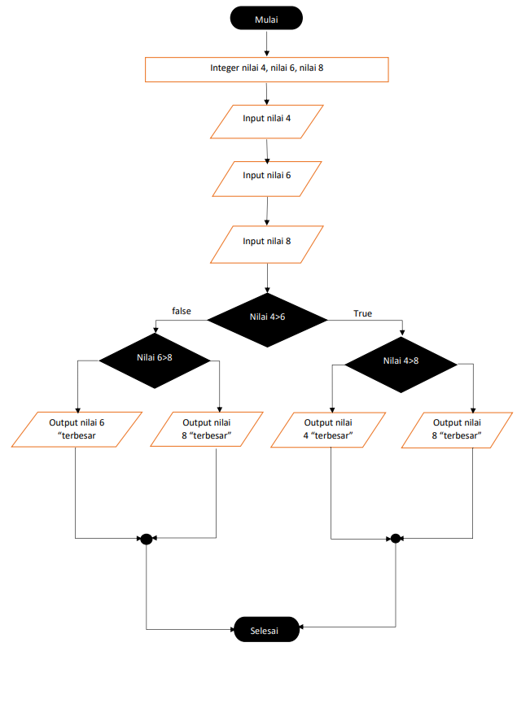
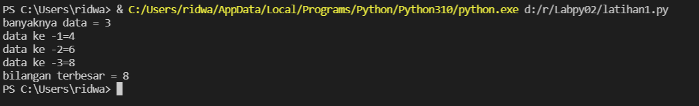

# TUGAS LABPY02

## Soal

## Jawab

Untuk menjawab soal tersebut saya membuat inputan data nilai sebagai berikut :

    a = int(input("Masukkan bilangan 1: "))
    b = int(input("Masukkan bilangan 2: "))
    c = int(input("Masukkan bilangan 3: "))

Kemudian masukkan angka yang diinginkan

saya masukan bilangan 1= 4
bilangan 2= 6
bilangan 3= 8

lalu saya membuat flowchart seperti yang ada dibawah :

Setelah itu saya menggunakan syntax dibawah :

    N=int(input("banyaknya data = "))
    if N>0:
        i=1
        x=int(input("data ke -"+str(i)+"="))
        max=x;total=x
        for i in range(2,N+1):
            x=int (input("data ke -"+str(i)+"="))
            total+=x
            if max<x:
                max=x

        print("bilangan terbesar =",max)

## Output

Dari syntax diatas sehingga menghasilkan output :

Terima kasih
